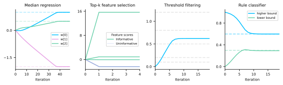

<p align="center">
  <picture>
    <source media="(prefers-color-scheme: dark)" srcset="docs/_static/logo/softtorch_logo_white_transparent.png">
    <source media="(prefers-color-scheme: light)" srcset="docs/_static/logo/softtorch_logo_black_transparent.png">
    
  </picture>
</p>

# Soft differentiable programming in PyTorch

[](https://pypi.org/project/softtorch/)
[](https://pypi.org/project/softtorch/)
[](https://github.com/a-paulus/softtorch/blob/main/LICENSE)
[](https://arxiv.org/abs/2603.08824)

Looking for JAX? See [SoftJAX](https://github.com/a-paulus/softjax).

## What is SoftTorch?

SoftTorch provides soft differentiable drop-in replacements for traditionally non-differentiable functions in [PyTorch](https://pytorch.org), including

- elementwise operators: `abs`, `relu`, `clamp`, `sign`, `round` and `heaviside`;
- tensor-valued operators: `(arg)max`, `(arg)min`, `(arg)quantile`, `(arg)median`, `(arg)sort`, `(arg)topk` and `rank`;
- comparison operators such as: `greater`, `eq` or `isclose`;
- logical operators such as: `logical_and`, `all` or `any`;
- functions for selection with indices such as: `where`, `take_along_dim` or `index_select`.

All operators offer multiple modes (controlling smoothness or boundedness of the relaxation) and adjustable softening strength.

All operators also support straight-through estimation, using the non-differentiable function in the forward pass and the soft relaxation in the backward pass.

*Note, while SoftTorch is designed to provide direct drop-in replacements for PyTorch's operators, soft axis-wise operators return a probability distribution over indices (instead of an index), effectively changing the shape of the function's output.*


## Installation
Requires Python 3.12+.
```
pip install softtorch
```


## Documentation

Available at https://a-paulus.github.io/softtorch/.


## Quick examples

**Robust median regression:**
Minimize the median absolute residual to be robust to outliers.
```python
import torch, softtorch as st

torch.manual_seed(0)
X = torch.randn(20, 3)
w_true = torch.tensor([1.0, -2.0, 0.5])
y = X @ w_true
y[0] = 1e6  # inject outlier

def median_regression_loss(w, X, y, mode="smooth"):
    residuals = y - X @ w
    return st.median(st.abs(residuals, mode=mode), mode=mode)

w = torch.zeros(3, requires_grad=True)
hard_loss = median_regression_loss(w, X, y, mode="hard")
print("Hard grad:", torch.autograd.grad(hard_loss, w)[0])
soft_loss = median_regression_loss(w, X, y, mode="smooth")
print("Soft grad:", torch.autograd.grad(soft_loss, w)[0])

w = torch.zeros(3)
for _ in range(50):
    w.requires_grad_(True)
    loss = median_regression_loss(w, X, y)
    g = torch.autograd.grad(loss, w)[0]
    w = (w - 0.1 * g).detach()
print("Learned w:", w, " (true:", w_true, ")")
```
```
Hard grad: tensor([ 0.2103,  0.1772, -0.8305])
Soft grad: tensor([ 0.0731,  0.7100, -0.2970])
Learned w: tensor([ 1.0000, -2.0000,  0.5000])  (true: tensor([ 1.0000, -2.0000,  0.5000]) )
```

**Top-k feature selection:**
Discover which features of a trained model are important.
```python
n_features, k = 10, 3
torch.manual_seed(42)
X = torch.randn(100, n_features)
w_model = torch.tensor([0, 2.0, 0, -1.5, 0, 0, 0, 5.0, 0, 0])
y = X @ w_model + 0.1 * torch.randn(100)

def feature_selection_loss(g, X, y, w_model, mode="smooth"):
    _, soft_idx = st.topk(g, k=k, mode=mode, gated_grad=False)
    mask = soft_idx.sum(dim=0)
    y_pred = (X * mask) @ w_model
    return torch.mean(st.abs(y_pred - y))

g = torch.zeros(n_features, requires_grad=True)
hard_loss = feature_selection_loss(g, X, y, w_model, mode="hard")
print("Hard grad:", torch.autograd.grad(hard_loss, g)[0] if hard_loss.requires_grad else torch.zeros_like(g))
soft_loss = feature_selection_loss(g, X, y, w_model, mode="smooth")
print("Soft grad:", torch.autograd.grad(soft_loss, g)[0])

g = torch.zeros(n_features)
for _ in range(5):
    g.requires_grad_(True)
    loss = feature_selection_loss(g, X, y, w_model)
    g_grad = torch.autograd.grad(loss, g)[0]
    g = (g - 0.001 * g_grad).detach()
print("Selected features:", torch.topk(g, k=k).indices)
```
```
Hard grad: tensor([0., 0., 0., 0., 0., 0., 0., 0., 0., 0.])
Soft grad: tensor([  2359.3386,     62.9980,   2359.3386,   -890.2852,   2359.3386,
          2359.3386,   2359.3386, -15688.0829,   2359.3386,   2359.3386])
Selected features: tensor([7, 3, 1])
```

**Differentiable threshold filtering:**
Learn a threshold that gates inputs.
```python
x = torch.tensor([0.2, 0.8, 0.5, 1.2, 0.1])
target_sum = 2.0  # sum of values above threshold = 2.0 (i.e. 0.8 + 1.2)

def filter_loss(t, x, target, mode="smooth"):
    mask = st.greater(x, t, mode=mode)
    return (torch.sum(mask * x) - target) ** 2

t = torch.tensor(0.0, requires_grad=True)
hard_loss = filter_loss(t, x, target_sum, mode="hard")
print("Hard grad:", torch.autograd.grad(hard_loss, t)[0] if hard_loss.requires_grad else torch.zeros_like(t))
soft_loss = filter_loss(t, x, target_sum, mode="smooth")
print("Soft grad:", torch.autograd.grad(soft_loss, t)[0])

t = torch.tensor(0.0)
for _ in range(20):
    t.requires_grad_(True)
    loss = filter_loss(t, x, target_sum)
    t_grad = torch.autograd.grad(loss, t)[0]
    t = (t - 0.1 * t_grad).detach()
print("Learned threshold:", t)
```
```
Hard grad: tensor(0.)
Soft grad: tensor(-0.6600)
Learned threshold: tensor(0.6211)
```

**Rule-based classifier:**
Learn decision boundaries `[lo, hi]` for a rule using soft logic and straight-through estimation. The rule is true if any element of a feature is inside `[lo, hi]`.
```python
x = torch.tensor([[0.2, 0.8], [0.5, 0.3], [0.9, 0.1], [0.4, 0.7], [0.1, 0.4], [0.2, 0.7], [0.4, 0.1], [0.4, 0.7],
               [0.7, 0.29], [0.3, 0.3], [0.61, 0.25], [0.4, 0.6], [0.0, 0.1], [0.5, 0.3], [0.4, 0.9], [0.1, 0.57]])
labels = torch.tensor([0.0, 1.0, 0.0, 1.0, 1.0, 0.0, 1.0, 1.0,
                    0.0, 1.0, 0.0, 1.0, 0.0, 1.0, 1.0, 1.0])

@st.st
def rule_loss(params, x, labels, mode="smooth"):
    lo, hi = params[0], params[1]
    above = st.greater(x, lo, mode=mode)
    below = st.less(x, hi, mode=mode)
    in_range = st.logical_and(above, below)
    preds = st.any(in_range, dim=-1)
    return ((preds - labels) ** 2).sum()

params = torch.tensor([0.0, 1.0], requires_grad=True)
hard_loss = rule_loss(params, x, labels, mode="hard")
print("Hard grad:", torch.autograd.grad(hard_loss, params)[0] if hard_loss.requires_grad else torch.zeros_like(params))
soft_loss = rule_loss(params, x, labels, mode="smooth")
print("Soft grad:", torch.autograd.grad(soft_loss, params)[0])

params = torch.tensor([0.0, 1.0])
for _ in range(20):
    params.requires_grad_(True)
    loss = rule_loss(params, x, labels)
    p_grad = torch.autograd.grad(loss, params)[0]
    params = (params - 0.01 * p_grad).detach()
print("Learned [lo, hi]:", params)
```
```
Hard grad: tensor([0., 0.])
Soft grad: tensor([-4.2777,  1.4152])
Learned [lo, hi]: tensor([0.2925, 0.5999])
```




## Citation

If this library helped your academic work, please consider citing: ([arXiv link](https://arxiv.org/abs/2603.08824))

```bibtex
@article{paulus2026softjax,
  title={{SoftJAX} \& {SoftTorch}: Empowering Automatic Differentiation Libraries with Informative Gradients},
  author={Paulus, Anselm and Geist, A.\ Ren\'e and Musil, V\'it and Hoffmann, Sebastian and Beker, Onur and Martius, Georg},
  journal={arXiv preprint},
  year={2026},
  eprint={2603.08824}
}
```

(Also consider starring the project [on GitHub](https://github.com/a-paulus/softtorch))

Special thanks and credit go to [Patrick Kidger](https://kidger.site) for the awesome [JAX repositories](https://github.com/patrick-kidger) that served as the basis for the documentation of this project.


## Feedback

If you have any suggestions for improvement or other feedback, please [reach out](mailto:paulus.anselm@gmail.com) or raise a GitHub issue!


## See also

### Other libraries on differentiable programming

**Differentiable sorting, top-k and rank**
[DiffSort](https://github.com/Felix-Petersen/diffsort): Differentiable sorting networks in PyTorch.  
[DiffTopK](https://github.com/Felix-Petersen/difftopk): Differentiable top-k in PyTorch.  
[FastSoftSort](https://github.com/google-research/fast-soft-sort): Fast differentiable sorting and ranking in JAX.  
[Differentiable Top-k with Optimal Transport](https://gist.github.com/thomasahle/48e9b3f17ead6c3ef11325f25de3655e) in JAX.  
[SoftSort](https://github.com/sprillo/softsort): Differentiable argsort in PyTorch and TensorFlow.  

**Other**  
[DiffLogic](https://github.com/Felix-Petersen/difflogic): Differentiable logic gate networks in PyTorch.  
[SmoothOT](https://github.com/mblondel/smooth-ot): Smooth and Sparse Optimal Transport.  
[JaxOpt](https://github.com/google/jaxopt): Differentiable optimization in JAX.  

### Papers on differentiable algorithms
SoftTorch builds on / implements various different algorithms for e.g. differentiable `topk`, `sorting` and `rank`, including:

[Projection onto the probability simplex: An efficient algorithm with a simple proof, and an application](https://arxiv.org/pdf/1309.1541)  
[Differentiable Ranks and Sorting using Optimal Transport](https://arxiv.org/pdf/1905.11885)  
[Differentiable Top-k with Optimal Transport](https://papers.nips.cc/paper/2020/file/ec24a54d62ce57ba93a531b460fa8d18-Paper.pdf)  
[SoftSort: A Continuous Relaxation for the argsort Operator](https://arxiv.org/pdf/2006.16038)  
[Sinkhorn Distances: Lightspeed Computation of Optimal Transportation Distances](https://arxiv.org/abs/1306.0895)  
[Smooth and Sparse Optimal Transport](https://arxiv.org/abs/1710.06276)  
[Smooth Approximations of the Rounding Function](https://arxiv.org/pdf/2504.19026v1)  
[Fast Differentiable Sorting and Ranking](https://arxiv.org/pdf/2002.08871)  
[Differentiable Sorting Networks for Scalable Sorting and Ranking Supervision](https://arxiv.org/abs/2105.04019)  

Please check the [API Documentation](https://a-paulus.github.io/softtorch/api/softtorch_operators) for implementation details.